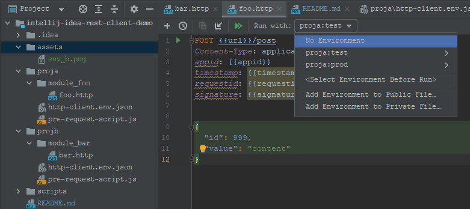
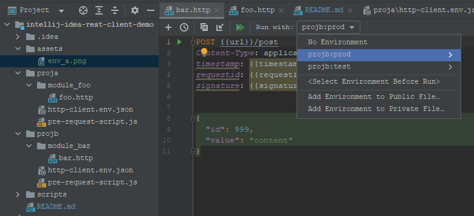
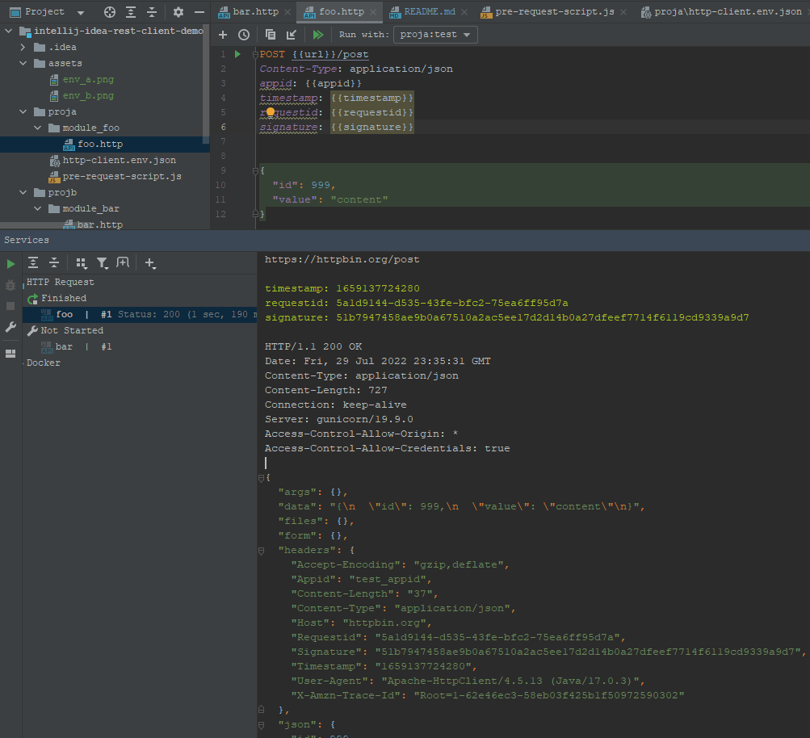

# intellij-idea-rest-client-demo

## 环境隔离
proja、projb分别是两个不同系统的接口脚本，两个目录都有环境配置文件，环境名称以proja:或者projb:开头，环境下拉框就只会列出本系统的环境。

```javascript
// proja/http-client.env.json
{
  "proja:test": {
    "url": "https://httpbin.org",
    "appid": "test_appid",
    "secret": "test_secret"
  },
  "proja:prod": {
    "url": "https://httpbin.org",
    "appid": "prod_appid",
    "secret": "prod_secret"
  }
}

// projb/http-client.env.json
{
    "projb:test": {
    "url": "https://httpbin.org",
        "secret": "test_secret"
},
    "projb:prod": {
    "url": "https://httpbin.org",
        "secret": "prod_secret"
}
}
```




## 请求前置脚本
执行请求前，会从http文件所在目录开始逐级网上搜索pre-request-script.js并执行。  
脚本中可以读取环境配置数据、请求信息、计算签名、设置临时变量。
```javascript
load(project + '/scripts/crypto-js.js');
load(project + '/scripts/core.js');

var appid = environment.getVariableValue('appid');
var timestamp = new Date().getTime().toString();
var requestid = guid();
var requestBody = request.getRequestBody() == null ? "" : request.getRequestBody().getText();

var array = [appid, timestamp, requestid, requestBody].sort();
var secret = environment.getVariableValue('secret');
var signature = CryptoJS.HmacSHA256(array.join(""), secret).toString();

variables.set("timestamp", timestamp);
variables.set("requestid", requestid);
variables.set("signature", signature);

log("timestamp: " + timestamp)
log("requestid: " + requestid)
log("signature: " + signature)
log("")
```

